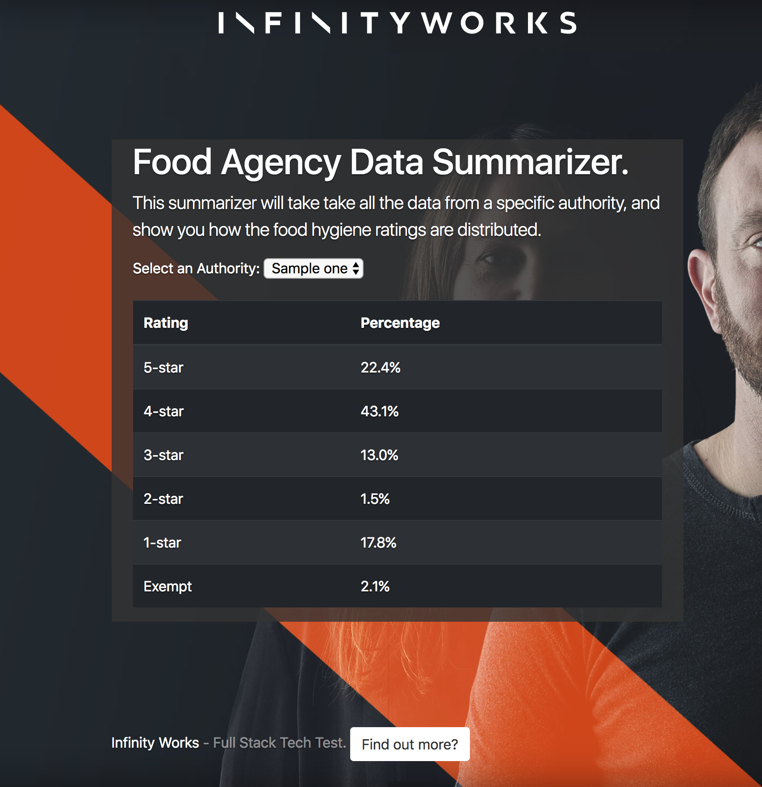

# Infinity Works - Full Stack Tech Test: Python

Python version of the Infinity Works technical test. It uses the `flask`_ microframework.

.. _flask: http://flask.pocoo.org

## Prerequisites

* Python 3
* Clone this repo
* Access to the internet
* Suitable development environment

## Getting Started

* Create and activate a new virtual environment:

    $ python3 -m venv venv
    $ . venv/bin/activate

* Install dependencies::

    $ pip install -e .

* Start the app:
    $ python app.py

* Visit http://localhost:5000 to receive the application.

## Submission

* Please do not fork this repository.
* Please do not commit your code to GitHub.

## Resources

* API Guideline
https://api.ratings.food.gov.uk/help
* Endpoints Documentation
https://api.ratings.food.gov.uk/Help/Index/

## Future plans

- tests
- stored data (in case of internet issues, updated regularly)
- regularly update stored data and use them except of rest calls
- remove .env file from repository
- dockerization
- CI/CX pipeline setup
- logging (except of print)